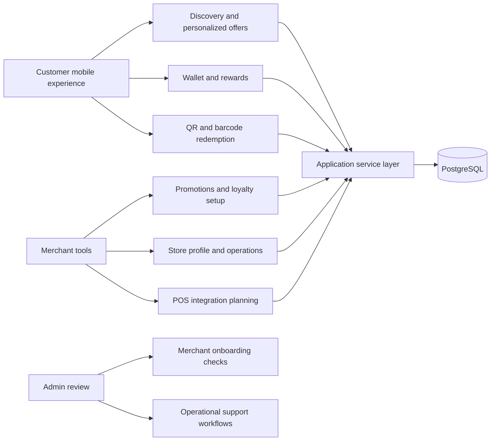

# NAMAA

Engineering case study for a local loyalty and merchant rewards product.

NAMAA is a mobile-first loyalty platform built around customers, merchants, and local discovery. I created this repository to explain the product architecture, technical decisions, and core engineering problems behind the app through written notes, runnable examples, and a visual case-study page.

Production app reference: [NAMAA Loyalty Rewards on the Apple App Store](https://apps.apple.com/us/app/namaa-loyalty-rewards/id6762251888)

Visual case study: [ibsz909i.github.io/namaa-case-study](https://ibsz909i.github.io/namaa-case-study/)

## What this repository includes

- A high-level look at product architecture, data flows, POS integration planning, and personalization logic.
- A set of executable code snapshots that demonstrate ranking, POS event normalization, redemption state transitions, and PostgreSQL schema thinking.
- A static HTML/CSS case-study page under `docs/` for a more visual review.
- A small test suite that proves the samples run and documents expected behavior.

Scope note: I keep credentials, customer and merchant records, partner configuration, live endpoints, and production source code out of this repository.

## Product summary

NAMAA is designed as a local rewards marketplace where customers can discover nearby merchants, collect rewards, redeem offers, and interact with merchant loyalty programs from one mobile-first experience. On the business side, merchants need tools for onboarding, promotions, store setup, customer engagement, QR/barcode redemption, and POS-aware transaction workflows.

The strongest technical parts of the product are:

- Customer, merchant, and admin workflows in one product system.
- Mobile-first UI with QR/barcode redemption flows.
- PostgreSQL-backed data modeling for customers, merchants, offers, wallet activity, and redemption events.
- POS integration planning for Clover and Square transaction workflows.
- Discovery ranking and offer personalization based on example data.
- QA and release thinking around real product behavior, not just static screens.

## Role

I worked on NAMAA as a full-stack and mobile engineer, covering product flows from the user interface through backend data workflows. The work includes customer experience, merchant tools, admin review flows, database modeling, redemption logic, POS integration planning, and performance-focused navigation patterns.

## Architecture overview



## Engineering highlights

### Mobile-first product flows

The product is designed around fast customer actions: open the app, find a merchant, view rewards, scan or show a code, and redeem. The product problems are the same ones employers care about: route state, loading states, wallet state, merchant detail performance, and clean UI behavior on smaller screens.

### Merchant operations

Merchant workflows include onboarding, store profile setup, promotions, customer engagement, transaction review, and loyalty configuration. This requires careful separation between customer-facing screens, merchant-facing tools, and admin review flows.

### POS-aware redemption

The product includes planning and workflow design around Clover and Square. The sample code shows how POS events can be normalized before idempotency checks and reward handling.

### Ranking and personalization

The app needs to decide which merchants and offers should be shown first. The sample in `samples/personalization-scoring.js` demonstrates the idea with fake data: proximity, customer interest, offer strength, merchant activity, and recency can be blended into a clear ranking score.

### PostgreSQL-backed workflows

The product relies on structured data: merchants, store profiles, offers, wallet events, redemptions, customer relationships, and admin states. The sample SQL shows how I think about constraints, relationships, idempotency, and query paths.

## Technology areas

- Frontend: React, TypeScript, responsive UI, mobile-first product screens.
- Mobile: Capacitor-style mobile delivery, QR/barcode flows, native app constraints.
- Backend: REST-style service workflows, authentication, authorization, role-based product access.
- Data: PostgreSQL, SQL modeling, data integrity, query-aware product design.
- QA: redemption flow checks, merchant flow verification, issue documentation, release readiness.
- Product: merchant onboarding, promotions, local discovery, wallet behavior, POS integration planning.

## Code snapshots

- `docs/index.html` - static case-study page.
- `docs/styles.css` - styling for the case-study page.
- `docs/architecture.md` - deeper architecture notes.
- `docs/code-snapshots.md` - guide to the sample code included here.
- `samples/personalization-scoring.js` - example ranking sample for local discovery and offer personalization.
- `samples/redemption-state-machine.js` - redemption lifecycle sample for QR/barcode-style reward use.
- `samples/pos-event-normalizer.js` - Clover and Square event normalization sample.
- `samples/schema.sql` - PostgreSQL schema snapshot for merchants, offers, wallets, redemptions, and POS events.
- `tests/*.test.js` - lightweight Node tests covering the samples.

Run the samples:

```bash
npm test
npm run demo:ranking
npm run demo:redemption
npm run demo:pos
```

## How to review this repo

1. Start with this README.
2. Open `docs/index.html` for the visual case study.
3. Read `docs/architecture.md` for the product and technical breakdown.
4. Read `docs/code-snapshots.md` to understand the included code.
5. Run `npm test` and review the files under `samples/` and `tests/`.
