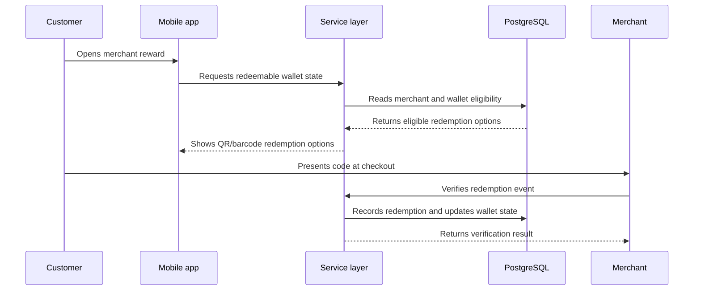

# NAMAA Architecture Notes

This document explains the product architecture behind NAMAA: customer flows, merchant workflows, admin review, redemption logic, POS integration boundaries, and data modeling.

## Product areas

NAMAA has three main product surfaces:

1. Customer experience
   - Merchant discovery
   - Wallet and reward visibility
   - QR/barcode redemption
   - Offer browsing
   - Store detail pages

2. Merchant experience
   - Store profile setup
   - Promotion management
   - Loyalty configuration
   - Customer engagement
   - POS-aware transaction workflows

3. Admin experience
   - Merchant application review
   - Store approval checks
   - Operational support
   - Data quality and rollout support

## Data model

At a product level, NAMAA needs structured tables or entities like:

- merchants
- store profiles
- offers
- customer wallet balances
- reward events
- redemption events
- merchant applications
- admin review states
- personalization signals

The important engineering point is not the exact table names. It is the way the product has to preserve data integrity across customer actions, merchant actions, POS-aware redemption, and admin approval workflows.

## Redemption flow

A redemption flow can be modeled like this:

## POS integration boundary

The integration work is organized around these boundaries:

- Clover and Square are treated as external POS systems.
- NAMAA needs a clean boundary between internal loyalty state and external transaction events.
- The product has to handle merchant identity, store identity, transaction references, redemption status, and retries.
- Webhook verification and retry handling need to stay separate from customer-facing reward state.

## Discovery and personalization

The product needs to rank stores and offers in a useful way. A simple scoring model can consider:

- Distance from the customer
- Strength of the offer
- Merchant activity
- Customer interest categories
- Recent interactions
- Whether the merchant is currently eligible for promotion

The sample in `samples/personalization-scoring.js` shows this with example data.
